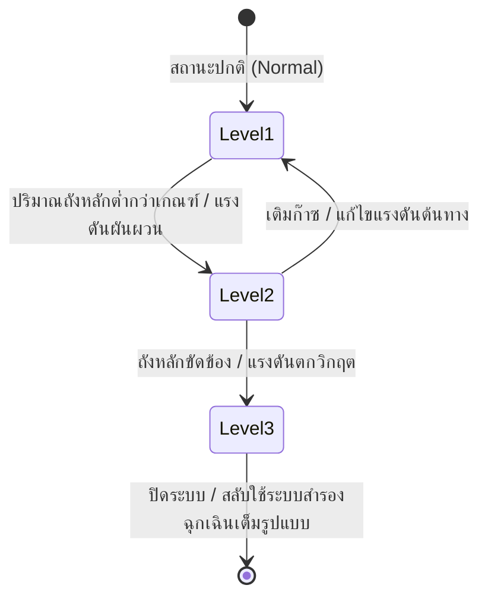
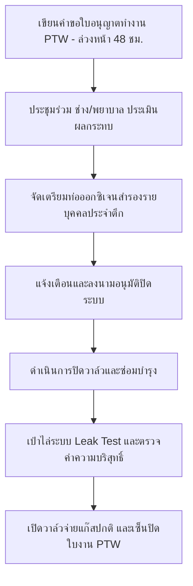

# คู่มือปฏิบัติงานฉุกเฉินและขั้นตอนการปิดระบบก๊าซทางการแพทย์ (Emergency & Planned Shutdown Protocols)
**โรงพยาบาลนครพิงค์ (NKP Hospital)**

คู่มือฉบับนี้กำหนดขึ้นเพื่อเป็นแนวทางการปฏิบัติงานทางวิศวกรรมและการแพทย์อย่างเป็นระบบ เมื่อเกิดเหตุการณ์ฉุกเฉินระบบจ่ายก๊าซออกซิเจนหลักขัดข้อง หรือเมื่อมีความจำเป็นต้องปิดระบบท่อส่งหลักเพื่อการบำรุงรักษาซ่อมแซม โดยอ้างอิงตามข้อกำหนดทางกฎหมายไทยและมาตรฐานสากลด้านความปลอดภัยของสถานพยาบาล

---

## ⚖️ 1. มาตรฐานวิศวกรรมและข้อกำหนดทางกฎหมายที่อ้างอิง (Regulatory Framework & Standards)

การดำเนินงานเกี่ยวกับระบบก๊าซไปป์ไลน์ทางการแพทย์ (Medical Gas Pipeline System - MGPS) ต้องสอดคล้องกับมาตรฐานทางกฎหมายและวิศวกรรมความปลอดภัยดังต่อไปนี้:

### 1.1 มาตรฐานสากล (International Standards)
1. **NFPA 99 (Health Care Facilities Code - Chapter 5: Gas and Vacuum Systems):**
   * **การสำรองฉุกเฉิน (Section 5.1.3.5.14):** กำหนดให้โรงพยาบาลที่มีถังเก็บก๊าซเหลวเป็นแหล่งจ่ายหลัก ต้องติดตั้งชุดเชื่อมต่อก๊าซสำรองฉุกเฉินภายนอกอาคาร (Emergency Oxygen Supply Connection - EOSC)
   * **ระบบแจ้งเตือนภัย (Section 5.1.9):** กำหนดการทำงานของ Master Alarm และ Area Alarm โดยต้องส่งสัญญาณเตือนเมื่อแรงดันในท่อส่งหลักสูงหรือต่ำกว่าแรงดันใช้งานปกติเกินกว่า $\pm 20\%$ (เช่น สำหรับระบบ 50 PSI สัญญาณจะเตือนเมื่อแรงดันต่ำกว่า 40 PSI หรือสูงเกิน 60 PSI)
   * **การติดตั้งวาล์วควบคุม (Section 5.1.4):** กำหนดให้มีวาล์วแยกส่วน (Zone Valves/Shutoff Valves) เพื่อความปลอดภัยในการปิดกักพื้นที่สำหรับการซ่อมบำรุงโดยไม่กระทบแผนกข้างเคียง
2. **ISO 7396-1 (Medical gas pipeline systems - Part 1: Pipeline systems for compressed medical gases and vacuum):**
   * **แหล่งจ่ายสามลำดับ (Section 5.2):** กำหนดให้สถานพยาบาลต้องมีแหล่งจ่ายก๊าซ 3 ชุดแยกจากกัน ได้แก่ แหล่งจ่ายหลัก (Primary Source), แหล่งจ่ายสำรอง (Secondary Source) และแหล่งจ่ายสำรองฉุกเฉินระดับที่สาม (Third Source / Reserve Source) เพื่อป้องกันการขัดข้องแบบเดี่ยว (Single Point of Failure)
3. **HTM 02-01 (Health Technical Memorandum 02-01 - Medical gas pipeline systems: Part B - Operational Management):**
   * **ระบบใบอนุญาตทำงาน (Section 10 - Permit to Work System):** กำหนดมาตรฐานความปลอดภัยในการปิดระบบเพื่อซ่อมแซม โดยต้องมีเอกสารยินยอมและลงนามยืนยันจากวิศวกรผู้ควบคุมระบบ ช่างเครื่องมือแพทย์ และหัวหน้าพยาบาลที่ได้รับผลกระทบทุกแผนกก่อนดำเนินการปิดวาล์วใดๆ

### 1.2 กฎหมายและมาตรฐานของประเทศไทย (Thai National Standards & Laws)
1. **มาตรฐานระบบก๊าซทางการแพทย์ โดยวิศวกรรมสถานแห่งประเทศไทย ในพระบรมราชูปถัมภ์ (วสท. 022001-22):**
   * กำหนดมาตรฐานความปลอดภัยในการออกแบบ การเชื่อมท่อทองแดงด้วยลวดเชื่อมเงินไร้ฟลักซ์ (Silver Brazing) การล้างท่อเพื่อขจัดคราบไขมัน (Degreasing) และการทดสอบแรงดันระบบส่งท่อ
2. **พระราชบัญญัติความปลอดภัย อาชีวอนามัย และสภาพแวดล้อมในการทำงาน พ.ศ. 2554 (กระทรวงแรงงาน):**
   * กฎกระทรวงกำหนดมาตรฐานในการบริหาร จัดการ และดำเนินการด้านความปลอดภัย อาชีวอนามัย และสภาพแวดล้อมในการทำงานเกี่ยวกับสารเคมีอันตราย พ.ศ. 2556 และข้อกำหนดการใช้ถังแรงดันและท่อก๊าซอัดแรงดันสูง
3. **เกณฑ์มาตรฐานการพัฒนาและรับรองคุณภาพโรงพยาบาล (HA - Hospital Accreditation) ของสถาบันรับรองคุณภาพสถานพยาบาล (สรพ.):**
   * **หมวดโครงสร้างทางกายภาพและความปลอดภัย (FMS - Fire & Safety / Utility System):** กำหนดให้โรงพยาบาลต้องมีแผนป้องกันภัยพิบัติ แผนการสแตนบายระบบสาธารณูปโภควิกฤต และการฝึกซ้อมสถานการณ์จำลองระบบก๊าซทางการแพทย์ขัดข้องอย่างน้อยปีละ 1 ครั้ง

---

## 🚨 2. ระดับการเตือนภัยและสถานะระบบ (Alert Levels Definition)

ระบบบริหารจัดการก๊าซแบ่งระดับสถานะความมั่นคงปลอดภัยออกเป็น 3 ระดับ เพื่อกำหนดขั้นตอนการตอบสนองหน้างาน:



* **ระดับที่ 1: สถานะปกติ (Level 1 - Normal Operation)**
  * แรงดันส่งในท่อหลัก: **50 - 55 PSI**
  * ปริมาณออกซิเจนเหลวถังหลัก: **สูงกว่า 120 inc/H2O**
* **ระดับเตือนภัยถังหลัก (Main Tank Warning Levels):**
  อ้างอิงตามสัญญา **TOR ออกซิเจนเหลว รพนครพิงค์.pdf** ตัวถังเหลวหลัก (VIE Tank ขนาดความจุ 37,000 ลิตร) และระบบต้องมีการตั้งค่าและควบคุมภัยออนไลน์ดังนี้:
  1. **Relief Valve (วาล์วนิรภัย):** ตั้งค่าการระบายความดันส่วนเกินไว้ที่ **250 PSI**
  2. **Bursting Disc (แผ่นนิรภัยป้องกันถังระเบิด):** ตั้งค่าทำงานชำรุดแรงดันสูงสุดไว้ที่ **350 PSI**
  3. **Vaporizer Insulation:** โครงสร้างท่อนำก๊าซและตัว Vaporizer ต้องหุ้มด้วยฉนวน Cellular Glass (Foam Glass) หนา 50 mm พร้อมอลูมิเนียมหุ้ม 0.5 mm
  4. **ระบบเฝ้าติดตามอัจฉริยะ (Telemonitoring System):** บริษัทคู่สัญญาต้องติดตั้งระบบ Telemonitoring แจ้งเตือนแบบเรียลไทม์ 5 สถานะวิกฤต ได้แก่ **ORDER LIQUID** (สัญญาณเติมก๊าซเหลว), **TANK LOW/HIGH PRESSURE** (ความดันถังผิดปกติ), และ **LINE LOW/HIGH PRESSURE** (ความดันในเส้นท่อจ่ายก๊าซหลักผิดปกติ)
  * สัญญาณแจ้งเตือนเงียบสงบ
* **ระดับที่ 2: สถานะเฝ้าระวัง (Level 2 - Warning Alert)**
  * ปริมาณออกซิเจนเหลวถังหลักลดต่ำกว่า: **60 inc/H2O (Safety Stock)** (ระบบส่งสัญญาณเตือน Tank Low) หรือแรงดันในระบบผันผวนอยู่ในช่วง **45-48 PSI** หรือ **58-60 PSI**
  * การดำเนินการ: ช่างเวรเข้าตรวจสอบเกจ Regulator และจุดเชื่อมต่อหน้างานทันที พร้อมแจ้งแผนการเติมก๊าซ
* **ระดับที่ 3: สถานะฉุกเฉินวิกฤต (Level 3 - Emergency/Crisis)**
  * แรงดันในเส้นท่อส่งหลักตกลงต่ำกว่า: **40 PSI** (ระบบส่งสัญญาณเตือน Low Alarm ทั่วทุกหอผู้ป่วย) หรือถังเหลวหลักหยุดจ่ายก๊าซเนื่องจากท่อชำรุด/รั่วไหลรุนแรง
  * การดำเนินการ: ประกาศภาวะฉุกเฉินระบบก๊าซ และเริ่มดำเนินการตามแผนสำรองทันที

---

## 🛠️ 3. ขั้นตอนปฏิบัติเมื่อเกิดเหตุฉุกเฉินก๊าซขัดข้อง (Emergency Protocol)

เมื่อเกิดสัญญาณเตือนระดับวิกฤต (Level 3) ให้ช่างเวรและพยาบาลประจำหอผู้ป่วยปฏิบัติตามแนวทางนี้ทันที:

### 3.1 การตรวจสอบและการสลับระบบสำรองอัตโนมัติ (ช่างเวรวิศวกรรม)
1. **ยืนยันการทำงานของระบบสำรองอัตโนมัติ:** 
   * เมื่อแรงดันระบบส่งหลักตกลงต่ำกว่าเกณฑ์ ชุดจ่ายก๊าซสำรองอัตโนมัติที่ **อาคาร 16 (ตึกฟ้า)** (Asset ID: 42592) จะทำการเปิดจ่ายก๊าซออกซิเจนจากท่อสำรองเข้าระบบโดยอัตโนมัติ ช่างเวรต้องรีบเดินทางไปที่สถานีอาคาร 16 ทันทีเพื่อตรวจสอบแรงดันส่งว่าควบคุมอยู่ที่ **50-52 PSI**
2. **สลับสถานีสำรองแมนนวลรายอาคาร (Manual Manifolds Activation):**
   * หากประเมินว่าระบบหลักขัดข้องเป็นเวลานาน ให้ทำการเดินเปิดวาล์วจ่ายก๊าซที่สถานีสำรองรายตึกตามลำดับความสำคัญของชีวิตผู้ป่วย (Priority Sequence) ดังนี้:
     1. **อาคาร 12 (ตึกชมพู):** จุดดูแล ICU, CCU และผู้ป่วยในวิกฤต
     2. **อาคาร 1 (ตึก อบ. - อาคารอุบัติเหตุ):** จุดดูแลห้องฉุกเฉิน (ER) *(ข้อควรระวัง: เช็ควาล์วมีอาการรั่วซึมย้อนกลับตามประวัติ JOB 277978 ให้ดำเนินการเปิดจ่ายอย่างระมัดระวังและเฝ้าระวังแรงดันย้อนกลับขณะเปลี่ยนท่อ)*
     3. **อาคาร 11 (ตึกเทา/ขาว):** หอผู้ป่วยใน 9 *(ข้อควรระวัง: ตรวจสอบสถานะการเปลี่ยนอะไหล่ตามบันทึกการเช็ค 10 มิ.ย. 69)*
     4. **อาคาร 10 (ตึกส้ม/เหลือง):** อาคารบำบัดรักษา 5 ชั้น
     5. **อาคาร 9 (ตึกเหลือง/แยกโรค):** *(ข้อควรระวัง: ปัจจุบันเรกกูเรเตอร์ฝั่งซ้ายชำรุดตาม JOB 283865 ให้ใช้การจ่ายจากฝั่งขวาฝั่งเดียวเท่านั้น)*
     6. **อาคาร 3 (OPD):** แผนกผู้ป่วยนอก

```text
[ลำดับการเปิดสถานีจ่ายก๊าซสำรองแมนนวล]
อาคาร 16 (Auto) ──> อาคาร 12 ──> อาคาร 1 (อบ.) ──> อาคาร 11 ──> อาคาร 10 ──> อาคาร 9 ──> อาคาร 3 (OPD)
```

3. **ประสานงานขนส่งด่วนและสั่งเติมก๊าซ:**
   * แจ้งบริษัทผู้ให้บริการถังเหลวหลักเพื่อเข้าซ่อมบำรุงทันที
   * แจ้ง บ.ลานนาแก๊ส เพื่อนำส่งท่อก๊าซสำรองขนาด 6 คิว เข้ามาเสริมทดแทนคลังท่อที่ถูกใช้งานทันที (กำหนดส่งด่วนภายใน 3 ชั่วโมง)

### 3.2 ขั้นตอนปฏิบัติสำหรับพยาบาลและแพทย์ประจำหอผู้ป่วย (Clinical Staff Protocol)
1. **เมื่อได้ยินสัญญาณ Area Alarm ดังเตือน:**
   * ให้พยาบาลเวรรีบตรวจสอบเกจวัดแรงดันหน้าตึก หากแสดงค่าต่ำกว่า 40 PSI ให้เตรียมความพร้อมเครื่องช่วยหายใจ
2. **เปลี่ยนไปใช้ระบบสำรองรายบุคคล (Individual Backup):**
   * นำถังออกซิเจนเคลื่อนที่แบบท่อ (Oxygen Cylinder) ที่สแตนบายอยู่ประจำหอผู้ป่วยมาต่อเข้ากับผู้ป่วยวิกฤตที่ใช้เครื่องช่วยหายใจ (Ventilator) หรือผู้ป่วยที่ใช้ออกซิเจนอัตราไหลสูง (High Flow) ทันที
3. **ประสานงานแจ้งช่างและเวรบริหาร:**
   * โทรแจ้งช่างเครื่องมือแพทย์หรือช่างเวรไฟฟ้ายืนยันสถานะแรงดันตก และรายงานเวรผู้ตรวจการพยาบาลเพื่อประสานงานภาพรวม

---

## 🔒 4. ขั้นตอนการปิดระบบก๊าซหลักเพื่อการซ่อมบำรุง (Planned Shutdown Protocol)

การปิดวาล์วจ่ายก๊าซหลักเพื่อซ่อมบำรุงหรือทดสอบระบบท่อส่งในพื้นที่ ต้องทำตามขั้นตอนเพื่อความปลอดภัยของชีวิตผู้ป่วยตามมาตรฐาน **HTM 02-01** อย่างเคร่งครัด:



### ขั้นตอนที่ 4.1: การขออนุญาตปิดระบบ (Permit to Work System)
1. **การยื่นคำขอ:** หัวหน้าวิศวกรผู้ควบคุมงานต้องเขียนแบบฟอร์ม **ใบอนุญาตปิดระบบก๊าซทางการแพทย์ (Permit to Work - PTW)** ส่งล่วงหน้าอย่างน้อย **48 ชั่วโมง** ก่อนวันปฏิบัติงาน
2. **การประเมินผลกระทบ:** ระบุตึก ชั้น หรือแผนกที่ท่อส่งก๊าซจะถูกปิดกักอย่างชัดเจน พร้อมทั้งกำหนดเวลาปิดและเปิดจ่ายก๊าซที่แน่นอน
3. **การลงนามยินยอม:** ใบอนุญาต PTW จะต้องได้รับการลงนามรับทราบและยินยอมจาก:
   * วิศวกรผู้ควบคุมระบบก๊าซทางการแพทย์ (ผู้ขอปิด)
   * หัวหน้าแผนกพยาบาลหรือแพทย์ผู้รับผิดชอบหอผู้ป่วยที่ได้รับผลกระทบ (ผู้ยินยอม)
   * ผู้อำนวยการโรงพยาบาลหรือประธานคณะกรรมการสิ่งแวดล้อมและความปลอดภัย (ผู้ผู้อนุมัติ)

### ขั้นตอนที่ 4.2: การเตรียมการก่อนปิดระบบ (Pre-shutdown Preparation)
1. **จัดเตรียมก๊าซสำรองเฉพาะจุด:** หอผู้ป่วยที่ได้รับผลกระทบต้องคำนวณจำนวนท่อก๊าซเคลื่อนที่ให้เพียงพอต่อการใช้งานของคนไข้ในแผนกตลอดช่วงเวลาที่ปิดระบบ (บวกเวลาเผื่อฉุกเฉินอีก 50%)
2. **การติดตั้งอุปกรณ์สำรอง:** นำท่อก๊าซสำรองไปเชื่อมต่อสแตนบายไว้ข้างเตียงผู้ป่วยหนักทุกคนก่อนเริ่มต้นการปิดระบบ
3. **การทดสอบสัญญาณสื่อสาร:** ตรวจสอบความพร้อมของระบบติดต่อสื่อสารระหว่างทีมช่างและหอผู้ป่วย

### ขั้นตอนที่ 4.3: ขั้นตอนการปิดระบบและซ่อมบำรุง (Shutdown & Isolation)
1. **ตรวจสอบความพร้อมครั้งสุดท้าย:** โทรศัพท์ยืนยันกับหัวหน้าหอผู้ป่วยว่าผู้ป่วยหนักทุกคนได้สลับไปใช้ออกซิเจนจากท่อสำรองเรียบร้อยแล้ว
2. **การปิดวาล์วควบคุม (Zone Valves):**
   * วิศวกรดำเนินการปิดวาล์วแยกส่วน (Zone Valve) ประจำแผนกหรือวาล์วส่งหลัก (Main Valve) ที่ระบุในใบอนุญาต
   * แขวนป้ายเตือนภัยสีแดงขนาดใหญ่ที่วาล์วระบุข้อความชัดเจน: **"ห้ามเปิดวาล์วเด็ดขาด! กำลังปฏิบัติงานซ่อมบำรุงระบบก๊าซ"**
3. **ดำเนินการซ่อมบำรุง:** ช่างเข้าซ่อมบำรุงระบบท่อหรืออุปกรณ์ตามแผนงาน

### ขั้นตอนที่ 4.4: การกู้คืนระบบและการทดสอบ (System Recovery & Safety Testing)
หลังจากการซ่อมบำรุงเสร็จสิ้น ก่อนจะเปิดก๊าซออกซิเจนเข้าระบบท่อส่งหลักเพื่อใช้งานกับผู้ป่วยจริง จะต้องดำเนินการทดสอบมาตรฐานความปลอดภัยดังนี้:
1. **การเป่าไล่ระบบ (Dry Nitrogen Purging):** เป่าท่อด้วยแก๊สไนโตรเจนแห้งเพื่อไล่ฝุ่น คราบเขม่า และความชื้นที่เกิดจากการเชื่อมท่อออกนอกระบบ
2. **การทดสอบการรั่วซึม (Pressure Leak Test):** อัดแรงดันไนโตรเจนที่ 1.5 เท่าของแรงดันใช้งาน (ประมาณ 75-80 PSI) และทิ้งไว้เพื่อตรวจสอบการรั่วซึมตามข้อต่ออย่างน้อย 2-4 ชั่วโมง (หรือ 24 ชั่วโมงสำหรับงานระบบใหญ่)
3. **การทดสอบความถูกต้องของท่อส่ง (Cross-Connection Test):** ตรวจสอบเพื่อให้มั่นใจว่าท่อก๊าซออกซิเจนไม่ได้ต่อสลับกับก๊าซชนิดอื่น (เช่น สลับกับท่ออากาศอัด หรือไนตรัสออกไซด์)
4. **การทดสอบความบริสุทธิ์ (Purity Test):** ตรวจสอบค่าความบริสุทธิ์ของก๊าซออกซิเจนที่ปลายสายต้องไม่ต่ำกว่า **99%** (สำหรับถังเหลวหลัก) หรือ **93%** (สำหรับเครื่องผลิต) และไม่มีกลิ่น คราบน้ำมัน หรือฝุ่นละอองหลงเหลืออยู่

### ขั้นตอนที่ 4.5: การเปิดใช้งานปกติ (Normal Re-activation)
1. **การเปิดวาล์ว:** ค่อยๆ เปิดวาล์วควบคุมและปรับตั้งแรงดันให้กลับมาอยู่ที่ **50 - 55 PSI**
2. **ยืนยันหน้างาน:** แจ้งพยาบาลประจำหอผู้ป่วยให้สลับตัวผู้ป่วยกลับมาใช้ออกซิเจนจากเต้ารับปลายสาย (Station Outlet) ตามปกติ
3. **ลงนามปิดใบงาน:** หัวหน้าพยาบาลและวิศวกรร่วมลงนามปิดใบงาน PTW เพื่อยืนยันว่าการส่งก๊าซกลับคืนสู่สภาวะปกติเรียบร้อยแล้ว

---

## 📋 5. บทบาทและหน้าที่ความรับผิดชอบ (Roles & Responsibilities)

| บทบาท / ฝ่าย | หน้าที่ความรับผิดชอบหลักในสถานการณ์ฉุกเฉินและการซ่อมบำรุง |
| :--- | :--- |
| **ทีมวิศวกรและช่างระบบก๊าซ** | - ตรวจเช็คสถานะและแรงดันชุดสลับสำรองอัตโนมัติ (B16) ทันทีเมื่อเกิดสัญญาณเตือน<br>- ดำเนินการเปิดวาล์วจ่ายสำรองรายตึกตามลำดับความสำคัญ<br>- ประสานงาน บ.ลานนาแก๊ส และคู่สัญญาจัดส่งก๊าซด่วน<br>- ทำหน้าที่ปิด-เปิดวาล์วและทดสอบระบบตามใบอนุญาต PTW |
| **ช่างเครื่องมือแพทย์** | - เตรียมความพร้อมและจัดสรรถังออกซิเจนท่อสำรอง (Cylinders) และอุปกรณ์ปรับอัตราไหล (Flowmeters) ให้แก่หอผู้ป่วยหนัก<br>- ร่วมตรวจสอบบอร์ดควบคุมสัญญาณเตือน (Area Alarm Panel) ในหอผู้ป่วยหลังคืนระบบ |
| **หัวหน้าพยาบาลและพยาบาลเวร** | - ดูแลสลับเครื่องช่วยหายใจและอุปกรณ์ออกซิเจนของผู้ป่วยไปใช้ท่อแก๊สสำรองข้างเตียงทันทีเมื่อแรงดันตก<br>- ประสานงานแจ้งสถานะคนไข้หนักแก่เวรบริหารโรงพยาบาล<br>- ตรวจสอบและลงนามเอกสารขอปิดระบบ (PTW) เพื่อรับทราบและเตรียมการพยาบาลล่วงหน้า |
| **เวรบริหารโรงพยาบาล (ENV/FMS)** | - อำนวยการและประสานงานสั่งการหน่วยงานสนับสนุนเมื่อเกิดเหตุฉุกเฉินวิกฤต<br>- รับเรื่อง อนุมัติ และลงนามควบคุมในใบอนุญาตปิดระบบก๊าซ (PTW) สำหรับงานซ่อมบำรุงตามแผน |

---

## 💡 6. โอกาสพัฒนาเพื่อลดความเสี่ยงเชิงรุก (Opportunity for Development - OFD)

เพื่อความปลอดภัยสูงสุดและเพิ่มเสถียรภาพในการบริหารจัดการระบบก๊าซวิกฤตของโรงพยาบาลในอนาคต ขอเสนอโอกาสพัฒนาเชิงรุกดังนี้:
1. **การติดตั้งระบบเฝ้าติดตามแรงดันทั้งระบบแบบออนไลน์ (Online Pressure Monitoring System):** ติดตั้งทรานส์ดิวเซอร์ตรวจจับแรงดันระบบดิจิทัลตามท่อร่วมและชุดจ่ายสำรองทุกอาคาร เพื่อแสดงผลข้อมูลแรงดันปัจจุบันแบบ Real-time เข้าสู่ระบบศูนย์ควบคุมวิศวกรรม
2. **ระบบบันทึกและแจ้งเตือนอัจฉริยะล่วงหน้า (Historical Logger & Predictive Alerts):** บันทึกสถิติแรงดันอย่างต่อเนื่องเพื่อประเมินอัตราการรั่วซึม (Leakage Trend) และระบบต้องวิเคราะห์เพื่อแจ้งเตือนช่างเวรทันทีหากพบความผันผวนของแรงดัน ก่อนที่ระดับความดันจะตกลงจนเข้าขั้นวิกฤตหรือเริ่มดัง Alarm ที่หอผู้ป่วย
