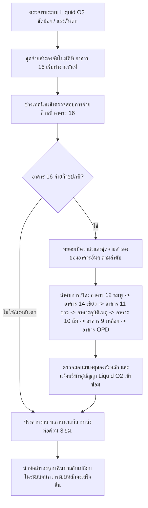

# ระบบที่ 1: แผนสำรองและคลังท่อก๊าซออกซิเจน (Oxygen Backup Plan & Inventory)

เอกสารนี้รวบรวมแผนการดำเนินงาน ข้อมูลการคำนวณปริมาตรการสำรองออกซิเจน และขั้นตอนการปฎิบัติงานเมื่อระบบออกซิเจนเหลวหลัก (Liquid Oxygen) เกิดปัญหาขัดข้องหรือไม่สามารถจ่ายก๊าซเข้าสู่ระบบหลักของโรงพยาบาลนครพิงค์ได้

---

## 📊 1. ข้อมูลการคำนวณและระดับการใช้งานก๊าซ

### ถังออกซิเจนเหลวหลัก (Main Liquid O2 Tank)
* **ขนาดถังสำรองหลัก:** 37,000 ลิตร
* **ปริมาณการใช้เฉลี่ยของโรงพยาบาล:** 74,000 ลบ.ม./เดือน หรือเฉลี่ย **2,467 ลบ.ม./วัน**
* **ช่วงระดับการใช้งานเฉลี่ย:** ระดับของถังลดลงเฉลี่ย 24 นิ้วน้ำ (inc/H2O) ต่อวัน
* **ระยะเวลาการใช้งานปกติ (ที่ระดับ 30,000 ลบ.ม.):** สามารถใช้งานได้ประมาณ **12.16 วัน**
* **ปริมาตรสำรองขั้นต่ำ (Safety Stock):** อยู่ที่ระดับ 60 นิ้วน้ำ (inc/H2O) หรือคิดเป็น 5,770 ลบ.ม. ซึ่งสามารถใช้สำรองต่อได้อีก **2.34 วัน** ก่อนก๊าซจะหมดถังโดยสิ้นเชิง

### การตั้งค่าการเตือนภัยและแรงดันถังเหลว (Tank Configuration)
* **ระดับเติมเต็มถัง (Full Level):** 250 inc/H2O
* **ระดับแจ้งเติมก๊าซ (Re-fill Level):** 120 inc/H2O
* **ระดับสำรองฉุกเฉิน (Safety Stock):** 60 inc/H2O
* **สัญญาณเตือนระดับต่ำ (Alarm Tank Low):** 30 inc/H2O
* **สัญญาณเตือนระดับสูง (Alarm Tank High):** 270 inc/H2O
* **แรงดันใช้งานจริงในระบบ (System Pressure):** 50 - 55 PSI
* **สัญญาณเตือนแรงดันต่ำ (Alarm O2 Low):** 48 PSI
* **สัญญาณเตือนแรงดันสูง (Alarm O2 High):** 60 PSI

---

## 🧮 2. ปริมาณความต้องการท่อสำรองกรณีฉุกเฉิน (Cylinder Backup Calculations)

หากต้องใช้ท่อก๊าซออกซิเจนแรงดันสูง (High-Pressure Cylinders) ขนาดมาตรฐานเพื่อสำรองการจ่ายก๊าซให้กับโรงพยาบาลทั้งวัน (2,467 ลบ.ม.):
* **กรณีใช้ท่อขนาด 6 ลบ.ม. (6 คิว):**
  * อัตราการใช้ทั้งวัน: **411 ท่อ/วัน**
  * อัตราการใช้รายชั่วโมง: **17.13 ท่อ/ชั่วโมง** (หรือประมาณ 102.79 ลบ.ม./ชั่วโมง)
* **กรณีใช้ท่อขนาด 7 ลบ.ม. (7 คิว):**
  * อัตราการใช้ทั้งวัน: **352.42 ท่อ/วัน**
  * อัตราการใช้รายชั่วโมง: **14.68 ท่อ/ชั่วโมง**

### ⏰ การบริหารเวลาจัดส่งและปริมาณสำรอง (Emergency Timeline)
* **ระยะเวลาขนส่งฉุกเฉิน (บ.ลานนาอินดัสเตรียลแก๊ส):** 
  * ในเวลาทำการ: **3 ชั่วโมง**
  * นอกเวลาทำการ: **8 ชั่วโมง**
* **ปริมาณก๊าซที่ต้องใช้ในช่วงรอ 3 ชั่วโมง:** 308.38 ลบ.ม. (คิดเป็นท่อขนาด 6 ลบ.ม. จำนวน **51.38 ท่อ**)
* **ขีดความสามารถการสำรองของโรงพยาบาล:** โรงพยาบาลมีท่อสำรองในห้องออกซิเจนรวมทั้งสิ้น **162 ท่อ** (6 ลบ.ม. 112 ท่อ และ 7 ลบ.ม. 50 ท่อ) ซึ่งสามารถสำรองจ่ายก๊าซให้ทั้งโรงพยาบาลได้นานถึง **9.44 ชั่วโมง**
* **สรุป:** ปริมาณท่อสำรองที่มีอยู่จริงในโรงพยาบาล **เพียงพอ** สำหรับรองรับเวลาจัดส่งฉุกเฉิน 3 ชั่วโมงของบริษัทผู้จัดส่งแก๊ส

---

## 🛠️ 3. ระบบท่อและอุปกรณ์ควบคุม (Manifold Piping System)

ระบบออกซิเจนสำรองในโรงพยาบาลนครพิงค์มี **จุดจ่ายสำรองทั้งหมด 8 จุด** เชื่อมต่อถึงกันด้วยท่อจ่ายหลัก (Main Ring/Loop Line) โดยมี **Isolation Valve** ระหว่างตึกสำหรับเลือก เปิด-ปิด การส่งก๊าซแยกตามตึกได้

### การควบคุมแรงดัน (Pressure Regulation)
* แก๊สแรงดันสูงจากท่อ (ประมาณ 2,000 PSI) จะเข้าสู่ **Regulator High** เพื่อลดแรงดันลงเหลือ **120 - 150 PSI** เพื่อสร้างแรงดันต่างศักย์
* แก๊สจะไหลผ่าน **Regulator Low** อีกชุดเพื่อลดแรงดันให้อยู่ในระดับใช้งานปกติคือ **50 - 55 PSI**
* **การสลับฝั่งอัตโนมัติ (Solenoid Valve Switchover):** เมื่อแรงดันทางด้าน Regulator High ของฝั่งที่ใช้งานอยู่ตกลงต่ำกว่า 150 PSI ตัว Solenoid Valve จะตัดการทำงานของฝั่งนั้นออกทันที และสลับไปใช้ฝั่งที่สแตนบายอยู่ (Ready) พร้อมกับส่งสัญญาณเตือน **Alarm Empty**

---

## 📋 4. ขั้นตอนการปฎิบัติงานเมื่อระบบหลักมีปัญหา (Emergency Protocol)

เมื่อเกิดเหตุออกซิเจนเหลวหลักไม่สามารถจ่ายงานได้ ให้ดำเนินงานตามขั้นตอนดังต่อไปนี้:

1. **สลับระบบอัตโนมัติ:** ปกติชุดจ่ายก๊าซสำรองที่ **อาคาร 16 (ตึกฟ้า)** จะเปิดสแตนบายไว้ในระบบเสมอ เมื่อแรงดันของระบบหลักลดลง ชุดจ่ายของอาคาร 16 จะเริ่มจ่ายก๊าซเข้าระบบโดยอัตโนมัติ
2. **การเข้าพื้นที่:** ช่างเวรต้องรีบเข้าไปตรวจสอบสภาพการทำงานของชุดจ่ายสำรองที่อาคาร 16 ทันทีเพื่อให้มั่นใจว่าแรงดันอยู่ในเกณฑ์ปกติ
3. **การเปิดสถานีสำรองอาคารอื่นเพิ่มเติม:** เมื่อยืนยันการทำงานของอาคาร 16 แล้ว ให้ช่างดำเนินการเปิดสถานีจ่ายสำรองของอาคารอื่นๆ ตามลำดับความสำคัญดังนี้:
   1. **อาคาร 12 (ตึกชมพู)**
   2. **อาคาร 14 (ตึกเขียว)**
   3. **อาคาร 11 (ตึกขาว)**
   4. **อาคารอุบัติเหตุ (ตึก อบ.)**
   5. **อาคาร 10 (ตึกส้ม)**
   6. **อาคาร 9 (ตึกเหลือง)**
   7. **อาคาร OPD (อาคาร 3)**
4. **ประสานงานแก้ไข:** ในระหว่างที่ใช้แก๊สสำรอง ให้ช่างตรวจสอบหาสาเหตุของระบบถังหลักและประสานงานบริษัทผู้ให้บริการถังเหลวหลักเข้าทำการแก้ไขเร่งด่วน
5. **การจัดเตรียมท่อทดแทน:** ประเมินระยะเวลาการซ่อมแซม หากคาดว่าจะใช้เวลานานเกินกว่าระยะเวลาสำรอง (9.44 ชั่วโมง) ให้รีบประสานงาน บ.ลานนาแก๊ส ทันทีเพื่อนำท่อ 6 ลบ.ม. มาสแตนบายเสริมการสำรอง

---

## 📋 5. ข้อกำหนดคุณลักษณะการจัดซื้อจัดจ้างออกซิเจนเหลว (Liquid Oxygen TOR Specifications)

ข้อมูลจากเอกสารข้อกำหนดขอบเขตงานจัดซื้อจัดจ้าง [TOR ออกซิเจนเหลว รพนครพิงค์.pdf](file:///E:/000_Antigraviti/MedicalGasNKP/Oxygen/01_Backup_Plan_and_Inventory/TOR%20%E0%B8%AD%E0%B8%AD%E0%B8%81%E0%B8%8B%E0%B8%B4%E0%B9%80%E0%B8%88%E0%B8%99%E0%B9%80%E0%B8%AB%E0%B8%A5%E0%B8%A7%20%E0%B8%A3%E0%B8%9E%E0%B8%99%E0%B8%84%E0%B8%A3%E0%B8%9E%E0%B8%B4%E0%B8%87%E0%B8%84%E0%B9%8C.pdf) มีเกณฑ์วิศวกรรมความปลอดภัยและระบบตรวจสอบทางไกลที่สำคัญดังนี้:

* **ปริมาณการจัดจ้างและมาตรฐาน:** จัดซื้อออกซิเจนเหลวไม่น้อยกว่า **500,000 ลิตร** มีค่าความบริสุทธิ์สอดคล้องตามมาตรฐาน **มอก. 540-2555** (ออกซิเจนทางการแพทย์)
* **เกณฑ์ความปลอดภัยของถังเก็บก๊าซเหลว (VIE Tank 37,000 ลิตร):**
  * **Relief Valve (วาล์วนิรภัยระบายแรงดัน):** ต้องตั้งค่าการระบายเมื่อแรงดันเกินไว้ที่ **250 PSI**
  * **Bursting Disc (แผ่นนิรภัยป้องกันถังระเบิด):** ต้องตั้งค่าแรงดันทำลายตัวไว้ที่ **350 PSI**
  * **ระบบฉนวนความร้อน Vaporizer:** หุ้มด้วยฉนวน Cellular Glass (Foam Glass) หนา 50 mm และปิดผิวด้วยแผ่นอลูมิเนียมหนา 0.5 mm
* **ระบบเฝ้าติดตามทางไกลแบบออนไลน์ (Telemonitoring System):**
  * ผู้รับจ้างมีหน้าที่ติดตั้งและส่งสัญญาณข้อมูลความดันและปริมาณถังหลักแบบ Real-time ผ่านเครือข่ายอินเทอร์เน็ตเข้าศูนย์ควบคุมของโรงพยาบาล
  * กำหนดสัญญาณเตือนวิกฤตออนไลน์ 5 สถานะที่ต้องทำงานร่วมกับระบบสวมจ่ายของโรงพยาบาลนครพิงค์:
    1. **ORDER LIQUID:** สัญญาณเตือนระดับของเหลวต่ำที่ควรกดคำสั่งสั่งเติมแก๊สเหลวเพิ่ม
    2. **TANK LOW PRESSURE:** สัญญาณเตือนเมื่อความดันในถังหลักตกลงต่ำ
    3. **TANK HIGH PRESSURE:** สัญญาณเตือนเมื่อความดันในถังหลักขึ้นสูงเกินปกติ
    4. **LINE LOW PRESSURE:** สัญญาณเตือนเมื่อความดันในเส้นท่อจ่ายก๊าซหลักต่ำกว่าเกณฑ์ใช้งานปกติ (แรงดันใช้งานปกติอยู่ที่ 50-55 PSI)
    5. **LINE HIGH PRESSURE:** สัญญาณเตือนเมื่อความดันในเส้นท่อจ่ายก๊าซหลักสูงเกินเกณฑ์ความปลอดภัย

---

## 📂 เอกสารและไฟล์ในโฟลเดอร์นี้

* **[Inventory CSV] [cylinder_inventory.csv](file:///E:/000_Antigraviti/MedicalGasNKP/Oxygen/01_Backup_Plan_and_Inventory/cylinder_inventory.csv):** ตารางสรุปจำนวนท่อก๊าซสำรองแยกตามอาคาร
* **[Word Document] [แผนออกซิเจนสำรอง เมื่อออกซิเจนหลักมีปัญห.docx](file:///E:/000_Antigraviti/MedicalGasNKP/Oxygen/01_Backup_Plan_and_Inventory/%E0%B9%81%E0%B8%9C%E0%B8%99%E0%B8%AD%E0%B8%AD%E0%B8%81%E0%B8%8B%E0%B8%B4%E0%B9%80%E0%B8%88%E0%B8%99%E0%B8%AA%E0%B8%B3%E0%B8%A3%E0%B8%AD%E0%B8%87%20%E0%B9%80%E0%B8%A1%E0%B8%B7%E0%B9%88%E0%B8%AD%E0%B8%AD%E0%B8%AD%E0%B8%81%E0%B8%8B%E0%B8%B4%E0%B9%80%E0%B8%88%E0%B8%99%E0%B8%AB%E0%B8%A5%E0%B8%B1%E0%B8%81%E0%B8%A1%E0%B8%B5%E0%B8%9B%E0%B8%B1%E0%B8%81%E0%B8%AB.docx):** ไฟล์แผนการดำเนินงานฉุกเฉินฉบับเต็ม
* **[Text Document] [แผนออกซิเจนสำรอง เมื่อออกซิเจนหลักมีปัญห.txt](file:///E:/000_Antigraviti/MedicalGasNKP/Oxygen/01_Backup_Plan_and_Inventory/%E0%B9%81%E0%B8%9C%E0%B8%99%E0%B8%AD%E0%B8%AD%E0%B8%81%E0%B8%8B%E0%B8%B4%E0%B9%80%E0%B8%88%E0%B8%99%E0%B8%AA%E0%B8%B3%E0%B8%A3%E0%B8%AD%E0%B8%87%20%E0%B9%80%E0%B8%A1%E0%B8%B7%E0%B9%88%E0%B8%AD%E0%B8%AD%E0%B8%AD%E0%B8%81%E0%B8%8B%E0%B8%B4%E0%B9%80%E0%B8%88%E0%B8%99%E0%B8%AB%E0%B8%A5%E0%B8%B1%E0%B8%81%E0%B8%A1%E0%B8%B5%E0%B8%9B%E0%B8%B1%E0%B8%81%E0%B8%AB.txt):** ข้อความที่สกัดจากไฟล์แผน
* **[Manifold Overview Excel] [ชุดจ่ายแก๊สออกซิเจนสำรอง(Reserve Supply).xlsx](file:///E:/000_Antigraviti/MedicalGasNKP/Oxygen/01_Backup_Plan_and_Inventory/ชุดจ่ายแก๊สออกซิเจนสำรอง(Reserve%20Supply).xlsx): ตารางสรุปบัญชีครุภัณฑ์ข้อมูลชุดจ่ายแก๊สสำรอง O2 และ N2O ทั้งหมด (อัปเดตล่าสุด)
* **[Readiness Report Word] [รายงานสรุปชุดจ่ายแก๊สสำรอง_อัปเดตล่าสุด.docx](file:///E:/000_Antigraviti/MedicalGasNKP/Oxygen/01_Backup_Plan_and_Inventory/รายงานสรุปชุดจ่ายแก๊สสำรอง_อัปเดตล่าสุด.docx): รายงานวิเคราะห์สถานะความพร้อมและการซ่อมบำรุงชุดจ่ายก๊าซสำรองแต่ละอาคาร (จัดหน้าขนาด A4 สวยงามแยกสีสันและจัดหมวดหมู่ชัดเจน)
* **[Manifold Detail Folder] [Reserve_Supply_Details/](file:///E:/000_Antigraviti/MedicalGasNKP/Oxygen/01_Backup_Plan_and_Inventory/Reserve_Supply_Details/):** โฟลเดอร์เก็บเอกสารรายละเอียดและแบบแปลนชุดจ่ายสำรองแยกตามตึก:
  * [O2_Reserve_Supply_B01.pdf (อาคาร 1 / ตึก อบ.)](file:///E:/000_Antigraviti/MedicalGasNKP/Oxygen/01_Backup_Plan_and_Inventory/Reserve_Supply_Details/O2_Reserve_Supply_B01.pdf)
  * [O2_Reserve_Supply_B03.pdf (อาคาร 3 / ตึก OPD)](file:///E:/000_Antigraviti/MedicalGasNKP/Oxygen/01_Backup_Plan_and_Inventory/Reserve_Supply_Details/O2_Reserve_Supply_B03.pdf)
  * [O2_Reserve_Supply_B09.pdf (อาคาร 9 / ตึกเหลือง)](file:///E:/000_Antigraviti/MedicalGasNKP/Oxygen/01_Backup_Plan_and_Inventory/Reserve_Supply_Details/O2_Reserve_Supply_B09.pdf)
  * [O2_Reserve_Supply_B10.pdf (อาคาร 10 / ตึกส้ม)](file:///E:/000_Antigraviti/MedicalGasNKP/Oxygen/01_Backup_Plan_and_Inventory/Reserve_Supply_Details/O2_Reserve_Supply_B10.pdf)
  * [O2_Reserve_Supply_B11.pdf (อาคาร 11 / ตึกขาว)](file:///E:/000_Antigraviti/MedicalGasNKP/Oxygen/01_Backup_Plan_and_Inventory/Reserve_Supply_Details/O2_Reserve_Supply_B11.pdf)
  * [O2_Reserve_Supply_B12.pdf (อาคาร 12 / ตึกชมพู)](file:///E:/000_Antigraviti/MedicalGasNKP/Oxygen/01_Backup_Plan_and_Inventory/Reserve_Supply_Details/O2_Reserve_Supply_B12.pdf)
  * [O2_Reserve_Supply_B13.pdf (อาคาร 13)](file:///E:/000_Antigraviti/MedicalGasNKP/Oxygen/01_Backup_Plan_and_Inventory/Reserve_Supply_Details/O2_Reserve_Supply_B13.pdf)
  * [O2_Reserve_Supply_B16.pdf (อาคาร 16 / ตึกฟ้า)](file:///E:/000_Antigraviti/MedicalGasNKP/Oxygen/01_Backup_Plan_and_Inventory/Reserve_Supply_Details/O2_Reserve_Supply_B16.pdf)
  * [O2_Reserve_Supply_ONC.pdf (ศูนย์มะเร็งขอนตาล)](file:///E:/000_Antigraviti/MedicalGasNKP/Oxygen/01_Backup_Plan_and_Inventory/Reserve_Supply_Details/O2_Reserve_Supply_ONC.pdf)
  * [N2O_Reserve_Supply_B01.pdf (ชุดจ่ายแก๊สไนตรัสออกไซด์ อาคาร 1)](file:///E:/000_Antigraviti/MedicalGasNKP/Oxygen/01_Backup_Plan_and_Inventory/Reserve_Supply_Details/N2O_Reserve_Supply_B01.pdf)
  * [N2O_Reserve_Supply_B10.pdf (ชุดจ่ายแก๊สไนตรัสออกไซด์ อาคาร 10)](file:///E:/000_Antigraviti/MedicalGasNKP/Oxygen/01_Backup_Plan_and_Inventory/Reserve_Supply_Details/N2O_Reserve_Supply_B10.pdf)
