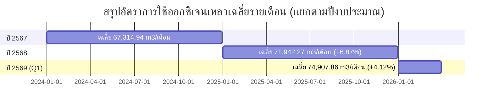

# 🏥 รายงานสรุปวิเคราะห์การใช้งานออกซิเจนทางการแพทย์
**โรงพยาบาลนครพิงค์ และ ศูนย์มะเร็งขอนตาล**  
*ประจำปีงบประมาณ 2566 – 2569 (ประวัติการใช้งานสะสม 31 เดือน)*

---

## 📌 สรุปสาระสำคัญสำหรับผู้บริหาร (Executive Summary)

การบริหารจัดการออกซิเจนทางการแพทย์เป็นปัจจัยด้านวิศวกรรมความปลอดภัยขั้นวิกฤต (Life-Critical Engineering) เพื่อรองรับผู้ป่วยผู้ป่วยหนัก ผู้ป่วยวิกฤต (ICU) และห้องผ่าตัด จากการวิเคราะห์ข้อมูลปริมาณการใช้งานออกซิเจนเหลวสะสมจำนวน **31 เดือน** (กันยายน 2566 ถึง มีนาคม 2569) พบสาระสำคัญดังนี้:

* **อัตราการใช้ออกซิเจนเหลวเฉลี่ยรวม:** **69,054.24 $m^3$/เดือน** (เฉลี่ยวันละ **2,301.81 $m^3$/วัน**)
* **การกระจายตามสัดส่วนพื้นที่:**
  * **โรงพยาบาลนครพิงค์ (ถังหลัก 37,000 ลิตร):** เฉลี่ย **67,173.09 $m^3$/เดือน** คิดเป็น **97.28%**
  * **ศูนย์มะเร็งขอนตาล:** เฉลี่ย **2,159.84 $m^3$/เดือน** คิดเป็น **2.72%**
* **สถิติปริมาณการใช้สูงสุด (Peak Consumption):** เดือน **มค. 69** รวม **80,182.24 $m^3$** อันเนื่องมาจากการเพิ่มขึ้นของจำนวนผู้ป่วยวิกฤตระบบทางเดินหายใจ
* **แนวโน้มการเติบโต (Growth Trend):** ปริมาณการใช้งานเติบโตอย่างต่อเนื่อง โดยปี 2568 มีอัตราการใช้เพิ่มขึ้น **+6.81%** จากปี 2567 และไตรมาสแรกของปี 2569 เพิ่มขึ้นอีก **+5.15%** จากปี 2568
* **ความมั่นคงด้านระบบสำรองฉุกเฉิน (Supply Security):** คลังท่อออกซิเจนสำรองประจำตึก 8 จุด (162 ท่อ) สามารถจ่ายแก๊สสำรองได้ **9.44 ชั่วโมง** ซึ่งครอบคลุมระยะเวลาจัดส่งฉุกเฉินของบริษัทผู้จัดส่ง (บ.ลานนาแก๊ส) ที่การันตีไว้ภายใน **3 ชั่วโมง**

---

## 📊 ตัวชี้วัดสำคัญ (Key Performance Indicators)

| ตัวชี้วัด (KPIs) | ค่าสถิติ | หน่วย | คำอธิบายและหมายเหตุ |
| :--- | :---: | :---: | :--- |
| **การใช้รวมเฉลี่ยรายเดือน** | **69,054.24** | $m^3$/เดือน | ค่าเฉลี่ยรวม 31 เดือน (รพ.นครพิงค์ + ศูนย์ขอนตาล) |
| **การใช้รวมเฉลี่ยรายวัน** | **2,301.81** | $m^3$/วัน | ประเมินจากฐาน 30 วัน/เดือน |
| **ยอดการใช้สูงสุด (Peak)** | **80,182.24** | $m^3$ | สถิติสูงสุด ณ เดือน **มค. 69** |
| **ยอดการใช้ต่ำสุด (Min)** | **45,416.56** | $m^3$ | สถิติต่ำสุด ณ เดือน **มีค.67** |
| **ความจุถังออกซิเจนเหลวหลัก** | **37,000** | ลิตร | คิดเป็นน้ำหนักก๊าซสุทธิ 14,614.37 Kg |
| **จำนวนท่อออกซิเจนสำรอง** | **162** | ท่อ | ขนาด 6 $m^3$ (112 ท่อ) และ 7 $m^3$ (50 ท่อ) |
| **ระยะเวลาสำรองแก๊สฉุกเฉิน** | **9.44** | ชั่วโมง | คำนวณจากอัตราการใช้สูงสุดของโรงพยาบาล |
| **ระยะเวลาการันตีจัดส่งฉุกเฉิน** | **3.00** | ชั่วโมง | การันตีตอบสนอง 24 ชม. โดย บ.ลานนาแก๊ส |

---

## 📈 ตารางสถิติปริมาณการใช้งานออกซิเจนเหลวรายเดือน (31 เดือน)

> [!NOTE]
> ปริมาณการใช้งานแสดงในหน่วย **ลูกบาศก์เมตร ($m^3$)** สกัดข้อมูลจากตาราง [ปริมาณการใช้ O2_มีนาคม2569.xlsx](file:///E:/000_Antigraviti/MedicalGasNKP/Oxygen/07_Liquid_Oxygen_Main_System/ปริมาณการใช้%20O2_มีนาคม2569.xlsx)

| ที่ | เดือน / ปี | รพ.นครพิงค์ ($m^3$) | ศูนย์มะเร็งขอนตาล ($m^3$) | ยอดรวมทั้งสิ้น ($m^3$) | หมายเหตุ / เหตุการณ์สำคัญ |
| :-: | :---: | :-: | :-: | :-: | :--- |
| 1 | **กย.66** | 68,075.84 | - | **68,075.84** |  |
| 2 | **ตค.66** | 74,308.56 | - | **74,308.56** |  |
| 3 | **พค.66** | 54,772.03 | - | **54,772.03** |  |
| 4 | **ธค.66** | 63,625.90 | - | **63,625.90** |  |
| 5 | **มค.67** | 63,057.99 | 1,417.74 | **64,475.73** |  |
| 6 | **กพ.67** | 66,424.48 | 1,249.62 | **67,674.11** |  |
| 7 | **มีค.67** | 44,303.94 | 1,112.62 | **45,416.56** | ❄️ **ยอดใช้ต่ำสุด** |
| 8 | **เมย. 67** | 76,933.62 | 1,773.51 | **78,707.13** |  |
| 9 | **พค. 67** | 73,154.32 | 1,972.48 | **75,126.81** |  |
| 10 | **มิย. 67** | 47,571.46 | 1,799.46 | **49,370.92** |  |
| 11 | **กค. 67** | 64,184.75 | 2,283.93 | **66,468.68** |  |
| 12 | **สค. 67** | 64,010.32 | 1,941.34 | **65,951.66** |  |
| 13 | **กย. 67** | 64,359.34 | 2,785.70 | **67,145.04** |  |
| 14 | **ตค. 67** | 71,584.06 | 2,629.98 | **74,214.04** |  |
| 15 | **พย. 67** | 70,502.09 | 2,681.89 | **73,183.98** |  |
| 16 | **ธค. 67** | 70,280.55 | 2,332.08 | **72,612.63** |  |
| 17 | **มค. 68** | 73,084.84 | 2,733.80 | **75,818.64** |  |
| 18 | **กพ. 68** | 67,186.38 | 2,816.46 | **70,002.85** |  |
| 19 | **มีค. 68** | 68,896.60 | 2,716.49 | **71,613.10** |  |
| 20 | **เมย. 68** | 62,101.53 | 2,845.96 | **64,947.50** |  |
| 21 | **พค. 68** | 69,171.00 | 2,426.65 | **71,597.65** |  |
| 22 | **มิย. 68** | 66,593.07 | 2,456.95 | **69,050.02** |  |
| 23 | **กค. 68** | 57,274.21 | 2,751.10 | **60,025.31** |  |
| 24 | **สค. 68** | 68,617.83 | 2,370.83 | **70,988.66** |  |
| 25 | **กย. 68** | 72,770.71 | 2,076.30 | **74,847.01** |  |
| 26 | **ตค. 68** | 73,573.46 | 2,353.14 | **75,926.60** |  |
| 27 | **พย. 68** | 69,524.84 | 1,972.49 | **71,497.33** |  |
| 28 | **ธค. 68** | 76,993.07 | 1,520.58 | **78,513.65** |  |
| 29 | **มค. 69** | 78,564.46 | 1,617.78 | **80,182.24** | 🔥 **ยอดใช้สูงสุด (Peak)** |
| 30 | **กพ. 69** | 64,359.32 | 1,877.32 | **66,236.64** |  |
| 31 | **มีค. 69** | 76,505.24 | 1,799.46 | **78,304.70** |  |

---

## 🔍 วิเคราะห์แนวโน้มและการทำงานของระบบ (In-Depth Analysis)

### 1. การเติบโตและการเปรียบเทียบรายปี (Yearly Trend Comparison)

* **ปี 2567:** อัตราการใช้เฉลี่ยอยู่ที่ **67,314.94 $m^3$/เดือน**
* **ปี 2568:** อัตราการใช้เฉลี่ยเพิ่มขึ้นเป็น **71,942.27 $m^3$/เดือน** (เติบโตขึ้น **+6.81%**)
* **ปี 2569 (Q1):** อัตราการใช้เฉลี่ยพุ่งสูงขึ้นเป็น **74,907.86 $m^3$/เดือน** (เติบโตขึ้น **+5.15%** จากปี 2568)
* **ปัจจัยสนับสนุน:** การเปิดใช้อาคารรักษาพยาบาลใหม่ และการเพิ่มขึ้นของเตียงผู้ป่วยหนักและ ICU ทางเดินหายใจ

---

### 2. วิเคราะห์โทรมาตร Real-time (Telemetry Log Analysis)

จากข้อมูลไฟล์โทรมาตรรายชั่วโมง [NPPH10011-History-28072026.xlsx](file:///E:/000_Antigraviti/MedicalGasNKP/Oxygen/07_Liquid_Oxygen_Main_System/NPPH10011-History-28072026.xlsx):
* **อัตราการลดลงของระดับแก๊ส (Burn Rate):** ในช่วงการใช้งานปกติ ถังหลัก 37,000 ลิตร มีระดับแก๊สลดลงเฉลี่ย **0.75 นิ้วต่อชั่วโมง** (คิดเป็นน้ำหนักก๊าซลดลง **~90.75 Kg/ชั่วโมง** หรือประมาณ **~78 $m^3$/ชั่วโมง**)
* **วงรอบการเติมแก๊ส (Refill Cycle):** ระบบโทรมาตรจะตั้งค่าแจ้งเตือนเมื่อระดับก๊าซลดลงเหลือประมาณ **60 – 70 นิ้ว** (~8,200 Kg) และบริษัทผู้จัดส่งจะนำรถเติมแก๊สเข้าเติมจนเต็มความจุ **120.75 นิ้ว (14,614.37 Kg)** ทุกๆ **3 ถึง 4 วัน**

---

### 3. ระบบความมั่นคงและแผนสำรองฉุกเฉิน (Emergency Reserve & Security)

> [!IMPORTANT]
> **การรับประกันความต่อเนื่องในการจ่ายแก๊ส (Continuity Guarantee)**
> 1. **คลังท่อแก๊สสำรอง (162 ท่อ):** มีการกระจายท่อสำรองไปตามสถานีจ่ายประจำอาคาร 8 จุด (B01 ถึง B16) สามารถจ่ายแก๊สสำรองทดแทนระบบหลักได้นาน **9.44 ชั่วโมง**
> 2. **ข้อตกลงระดับการให้บริการ (SLA 3 ชั่วโมง):** อ้างอิง [5 หนังสือรับรองการให้บริการฉุกเฉิน.pdf](file:///E:/000_Antigraviti/MedicalGasNKP/Oxygen/07_Liquid_Oxygen_Main_System/5%20หนังสือรับรองการให้บริการฉุกเฉิน.pdf) บ.ลานนาแก๊ส การันตีจัดส่งแก๊สเติมถังหลักภายใน **3 ชั่วโมง** ตลอด 24 ชั่วโมง ซึ่งน้อยกว่าระยะเวลาสำรองของท่อ 9.44 ชั่วโมงอย่างมีนัยสำคัญ
> 3. **ระบบสลับฝั่งจ่ายอัตโนมัติ (Automatic Manifold):** มีชุดควบคุม ESP32 และ Solenoid Valve ช่วยสลับฝั่งจ่ายท่อแก๊สทันทีเมื่อฝั่งใช้งานหมดแรงดัน

---

## 💡 ข้อเสนอแนะเชิงกลยุทธ์และการพัฒนา (Strategic Recommendations)

1. **เตรียมความพร้อมรองรับอาคารหัวใจ 12 ชั้น:**
   * งบประมาณก๊าซทางการแพทย์ **60,000,000 บาท** จะเพิ่มปริมาณการใช้ออกซิเจนอีกประมาณ 15-20% ควรพิจารณาปรับความถี่วงรอบการเติมแก๊สเข้าถังหลักจากเดิมทุก 3-4 วัน เป็นทุก 2-3 วัน
2. **ขยายระบบมอนิเตอร์โทรมาตรแบบรวมศูนย์ (Centralized Telemetry Dashboard):**
   * เชื่อมโยงสัญญาณจากถังหลัก NPPH10011, NPPH20011 และตู้ Area Alarm ทุกอาคาร เข้าสู่แดชบอร์ดศูนย์ควบคุมวิศวกรรมอาคาร 12 ชั้น เพื่อรับแจ้งเตือนแรงดันตกแบบ Real-time
3. **การบำรุงรักษาเชิงป้องกัน (PM) ตามมาตรฐาน Zero Failure:**
   * ดำเนินการซ่อมบำรุงตู้จ่ายก๊าซและปรับเปลี่ยนชุดอุปกรณ์ Ohio Medical Maintenance Kit ตามแผนพัฒนาปี 2570 เพื่อให้เป็นไปตามมาตรฐานความปลอดภัย NFPA 99

---
*รายงานจัดทำโดย Antigravity AI - ออกแบบและจัดทำโดยกลุ่มงานโครงสร้างและวิศวกรรมการแพทย์ หมวดงานเครื่องมือแพทย์ โรงพยาบาลนครพิงค์ (28 กรกฎาคม 2569)*
